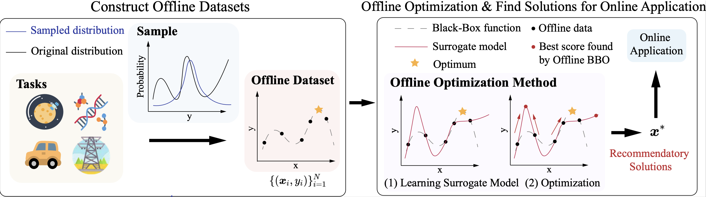

# SOO-Bench: Benchmarks for Evaluating the Stability of Offline Black-Box Optimization



This repository contains the code of "SOO-Bench: Benchmarks for Evaluating the Stability of Offline Black-Box Optimization". Unlike traditional benchmarks that focus primarily on identifying the optimal solution, SOO-Bench incorporates a **stability indicator** specifically designed to assess the stability of algorithms throughout the whole optimization process. Additionally, this suite provides a diverse array of offline optimization tasks and datasets spanning various fields such as satellite technology, materials science, structural mechanics, and automotive manufacturing. Each component is **highly customizable**, allowing adjustments in data sampling distribution, task complexity, constraints, and more.

# :page_facing_up: Offline Black-Box Optimization

Offline optimization aims to make full use of the offline data and finally recommend potential high-quality solutions to be applied online without actively querying the solutions online. Due to the exploration nature of global optimization, optimizers may tend to try unseen out-of distribution solutions for potentially better performance (i.e., find much better solutions than the offline dataset). As the optimization procedure proceeds, the quality of solutions may tend to decline. It is difficult to determine when to stop the optimization procedure and return the final solution without active evaluation feedback. Previous work has suggested that by specifying the number of stopping steps for optimization, good results can be achieved by adjusting the step size or modifying the model for experiments. However, this is often not feasible in real life. Therefore, we hope to maintain a steady improvement throughout the optimization process, or at least maintain stability so that the solutions at any step will not be too bad.

# :computer: Installation

## :wrench: Installation

SOO-Bench can be installed with the complete set of benchmarks via our pip package. For a stable installation and usage, we suggest that you use `CUDA version 11.7`  or higher, and python > 3.8. 

Firstly, SOO-Bench can be installed using anaconda.


### Quick Installation

```bash
# install revive
pip install -e ./revive_hybrid

# install soo-bench
pip install -e .

# install dependencies of algorithms
pip install -r requirements.txt
```
If you encounter resource occupancy or other problems when running `revive` tasks, you can try to modify serialization.py in torch:  `def load(f, map_location=None, pickle_module=pickle, **pickle_load_args)` to `def load(f, map_location="cpu", pickle_module=pickle, **pickle_load_args)`.

You can find the `serialization.py` by running the following code in python:

```python
# python
import torch
import os
path_to_serialization = os.path.abspath(os.path.join(torch.__file__,'../serialization.py'))
print(path_to_serialization)
```

### Test installation
Run following code in the environment just established as a test.
```python
from soo_bench.Taskdata import OfflineTask, REGISTERED_TASK

print(REGISTERED_TASK.keys())
# dict_keys(['gtopx_data', 'cec_data', 'hybrid_data', 'mujoco_data'])

# test gtopx
task = OfflineTask('gtopx_data', benchmark=2, seed=1)

num = 2
task.sample_x(num)
task.sample_y()
x = task.x
y = task.y
print(x)
print(y)

```
## :construction_worker: Usage
### 1. generate data
``` python
from soo_bench.Taskdata import OfflineTask,REGISTERED_TASK

task = OfflineTask(task='gtopx_data', benchmark=1, seed=1)
print('parameter "task" can be:',REGISTERED_TASK.keys())

#method 1 (Recommended)
n = 10
task.sample_bound(n)
x = task.x
y = task.y
print(x,y)

# method 2
n = 10
task.sample_x(n)
task.sample_y()
x = task.x
y = task.y
print(x,y)
```
### 2. use oracle function
```python
from soo_bench.Taskdata import OfflineTask
import numpy as np
task = OfflineTask(task='gtopx_data', benchmark=1, seed=1)
x = task.sample_x()
y = task.sample_y()

ndim = task.var_num # dimension of x
xx = np.array([.0 for i in range(ndim)])
yy,cons = task.predict(xx) # return the oracle function value of xx and the constraint function value. 
# if the task is a unconstraint task, 'cons' is useless.
print(yy, cons)
```

### 3. add your own dataset
More examples can be seen in `soo_bench.Taskunit`. Here we make a simple one.
```python
# in your python code
import numpy as np
from soo_bench.Taskdata import OfflineTask, register_task
from soo_bench.Taskunit import TaskUnit

# step1: define your own dataset
class Task_simple(TaskUnit):
    TASK_NAME = 'simple_data' # the name of your task

    def init(self, benchmark, seed, *args, **kwargs):
        '''
        Define your dataset, can be multiple benchmarks.
        This function nessary to override in every new TaskUnit. Will be executed in __init__
        
        self.obj_num, self.var_num, self.xl,self.yl
        must be set.
        '''
        if benchmark == 1: 
            self.obj_num = 1 # number of objectives
            self.var_num = 2 # number of sample dimension
            self.con_num = 0 # number of constraint functions
            self.xl = [ -10,  -10] # lower_bound of every dimension
            self.xu = [10, 10] # upper_bound of every dimension
        elif benchmark == 2:
            self.obj_num = 1
            self.var_num = 2
            self.con_num = 1 # benchmark 2 has 1 constraint
            self.xl = [-10,-10,-10]
            self.xu = [10,20,30]
        else:
            raise Exception(f"benchmark {benchmark} is not found in task {self.__class__.__name__}")
    
    def predict(self, x:np.ndarray):
        '''
        Define your oracle function and constraint functions(if any).
        Notice that your objective is to maximize this function.
        It is nessary to override. 

        x has already been transformed to 2-d np.array.
        '''
        import os
        root = os.path.dirname(os.path.abspath(__file__))
        path_trained_models = os.path.join(root,'data')
        
        if self.benchmark == 1:
            # unconstraint benchmark
            # y = -(x1^2 + x2^2)
            result = - x[:,0] **2 - x[:, 1]**2
            return result, 0 # value, constraint(no constraints)
        elif self.benchmark == 2:
            # constraint benchmark
            # y = -(x1^2 + x2^2 + x3^2)
            result = - x[:,0] **2 - x[:, 1]**2 - x[:,2]**2
            
            g = np.zeros((len(x), 1))
            # s.t. g1 = x1 + x2 >= 0
            g[:,0] = x[:, 0]+ x[:,1]**2
            
            return result, g # value, constraint

# step2: register your own dataset
register_task('simple_data',Task_simple)

# step3: use it
task = OfflineTask('simple_data', benchmark=1, seed=1)
task.sample_bound(10)
print(task.x)
print(task.y)
print(task.predict(task.x))

task = OfflineTask('simple_data', benchmark=2, seed=1)
task.sample_bound(10)
print(task.x)
print(task.y)
print(task.predict(task.x))

```
### 4.use cache to accelerate data generating process
you can use cache to accelerate the sampling.
```python
import numpy as np
from soo_bench.Taskdata import OfflineTask, register_task, \
                            set_use_cache,change_cache_path,clear_cache, CACHE_PATH

set_use_cache(True) # if need to use cache to accelerate `task.sample_bound`
# change_cache_path('./your_cache_path') # if not given, cache will be saved in default path 
clear_cache() # will clear previous saved cache

task = OfflineTask('gtopx_data', benchmark=2, seed=1)
task.sample_bound(10)
print(task.x)
print(task.y)


task = OfflineTask('gtopx_data', benchmark=2, seed=1)
task.sample_bound(10) # will use the cache
print(task.x)
print(task.y)

task = OfflineTask('gtopx_data', benchmark=2, seed=1)
x = task.sample_x(10) # will NOT use the cache
y = task.sample_y()
print(task.x)
print(task.y)
```


### 5.An example to use the dataset

```python
import numpy as np
from soo_bench.Taskdata import *

def your_algorithm(x,y):
    'repace this to your real algorithm function'
    return [x[0]]

set_use_cache(True)
taskname = 'gtopx_data' # explained later
benchmarkid = 1 # explained later
seed = 0

task = OfflineTask(task = taskname,  benchmark=benchmarkid, seed = seed)

# generate sample list 'x'
task.sample_bound(num=10000, low=0, high=100)
x = task.x
y, cons = task.y, task.cons # generate score list 'y' and constraint function value list 'cons' corresponding to x


# filter the samples that violate the constraints.
if task.is_constraint():
    # a valid samples is defined that every constraint function value is non negtive. 
    indx = []
    for con in cons:
        indx.append(np.all(con>=0))
    x = x[indx]
    y = y[indx]
    cons = cons[indx]

x_after = your_algorithm(x, y)
# Apply your optimization algorithm to the dataset.
# The 'your_algorithm' is a placeholder for the actual algorithm you would use.

score, cons = task.predict(x_after)
print(score)
```
## :computer_mouse: Run Algorithms
```python
./run.sh
```
After the algorithms finished, their results will be saved in 
``` bash
ls ./results/constraint
ls ./results/unconstraint
```
You can gather these results using following scripts:

```bash
# gather these results as csv
python ./scripts/getresult_SI.py
# the csv file will be saved at
# ./results/summary/results_unconstraint.csv
# and
# ./results/summary/results_constraint.csv

# conver above 2 csv files to a more readable form
python ./scripts/getresult_SI_translator.py
# the result will be saved at
# ./results/summary/results_unconstraint_translate.csv
# and
# ./results/summary/results_constraint_translate.csv
```

## :information_source: Baselines

To reproduce the performance of baseline algorithm reported in our work, you may then run `./run.sh` in each method directory. At the same time, please ensure that the conda environment `soo-bench-mp` is activated in the bash session.

## hardware environment 
we have test different hardware environment, including:
* Ubuntu 20.04, 1 × 2080Ti, CUDA 11.8
* Ubuntu 20.04, 1 × 3080Ti, CUDA 11.8
* Ubuntu 22.04, 1 × 3090, CUDA 12.0


## :art: Customization

You can perform advanced customization on several sections, as follows:


**The degree of missingness on the dataset:** Since we are maximizing the task, the degree of missingness on the high side of the dataset indicates missingness near the optimal value, and the degree of missingness on the low side indicates missingness near the lowest value of the dataset. The optimization hopes to find the best possible solution, so missingness on the high side is more fatal, while missingness on the low side may affect the amount of training data to a greater extent. Users can adjust the difficulty of optimization by controlling the degree of missingness. Users can control it through:

```python
task.sample_bound(n, low=0, high=100)
```

**Data distribution:** Uniform distribution is too simple, and users can override the way data is sampled to adjust the difficulty of the task. Here is a example.
```python
# in your python code
import numpy as np
import random
from soo_bench.Taskdata import OfflineTask, register_task
from soo_bench.Taskunit import Task_GTOPX

# step1: override the taskunit you need.
class Task_GTOPX_user(Task_GTOPX):
    TASK_NAME = 'user_gtopx_data'
    def sample_x_ignore_constraints(self, num=2):
        '''override this function instead of TaskUnit.sample_x'''
        result = []
        
        # replace the code below
        x_values = []
        for _ in range(num):
            for lower, upper in zip(self.xl, self.xu):
                x = random.uniform(lower, upper)
                x_values.append(x)
            result.append(x_values)
            x_values = []
        
        return result
# step2: register your own dataset
register_task('user_gtopx_data',Task_GTOPX_user)

# step3: use it
task = OfflineTask('user_gtopx_data', benchmark=3, seed=1)
task.sample_bound(10)
print(task.x)
print(task.y)
print(task.predict(task.x))

task = OfflineTask('user_gtopx_data', benchmark=2, seed=1)
task.sample_x(10)
task.sample_y()
print(task.x)
print(task.y)
print(task.predict(task.x))
```


**Constraints:** You can choose whether there are constraints on the task, for example, `benchmark=0` means constrained problem, and `benchmark=1` means unconstrained problem in hybrid task.


